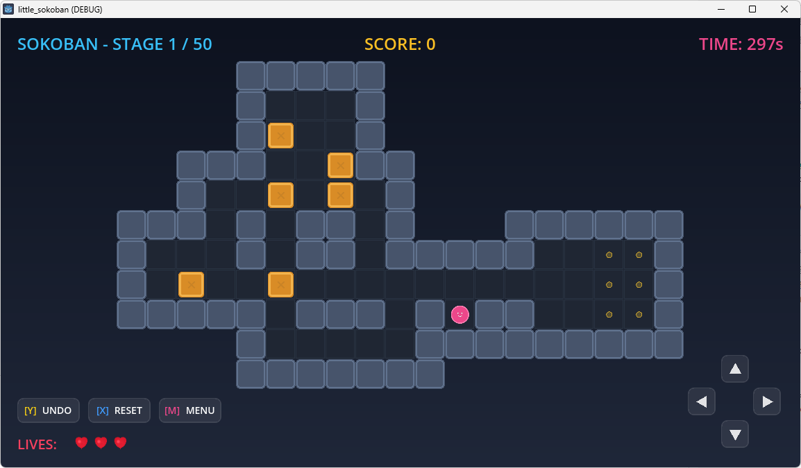
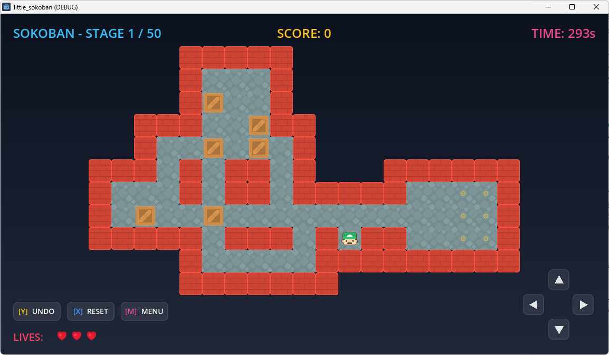

# Little Sokoban (꼬마 소코반)

Godot 4 엔진 기반으로 개발된 클래식 **소코반 1스테이지(Sokoban Level 1)** 게임 프로젝트입니다. 1982년 히로유키 이마바야시(Hiroyuki Imabayashi)가 설계한 오리지널 맵 구성을 기반으로 하고 있으며, 다양한 조작 인터페이스와 세련된 시각 효과를 제공합니다.

## 주요 기능

1. **하이브리드 조작 인터페이스**
   - **키보드**: 방향키 및 WASD 키로 캐릭터 이동.
   - **게임패드**: D-pad 및 왼쪽 아날로그 스틱으로 캐릭터 이동.
   - **마우스**: 빈 공간이나 목표 지점을 클릭하면 `AStarGrid2D` 경로 알고리즘을 사용해 플레이어가 최단 경로로 자동 이동. 마우스 드래그를 통한 스와이프 조작도 지원.
   - **터치 스크린**: 스와이프 제스처 및 우측 하단에 위치한 반투명 가상 D-pad 버튼 지원.
   - **심리스 입력 전환**: 마우스 클릭 직후에도 키보드/패드 신호가 들어오면 입력 가로채기(포커스 뺏김) 없이 즉시 전환되어 유연하게 플레이할 수 있습니다.

2. **Xbox 게임패드 버튼 가이드 및 키 매핑**
   - 사용자 편의를 위해 UI 버튼 내부에 Xbox 패드 레이아웃 기준의 직관적인 영문 키 프롬프트(`[Y]`, `[X]`, `[A]`)를 색상별로 표시했습니다.
   - **[Y] (노란색)**: 직전 이동 및 상자 밀기 되돌리기 (`↺ UNDO`)
   - **[X] (파란색)**: 스테이지 초기화 (`⟲ RESET`)
   - **[A] (초록색)**: 승리/게임오버 화면에서 다시 시작 (`PLAY/TRY AGAIN`)

3. **게임 플레이 메커니즘**
   - **실시간 HUD**: 점수(상자 안착당 100점), 제한 시간(300초 카운트다운), 생명 수(❤ 하트 표시)를 실시간 반영.
   - **언두(Undo) 시스템**: 움직임 횟수 제한 없이 부드러운 역방향 애니메이션으로 상태를 되돌릴 수 있습니다.
   - **레이어 개선**: 승리 및 게임 오버 오버레이 화면이 스테이지 벽 상단에 완벽하게 덮이도록 드로우 인덱스를 제어하여 텍스트 가독성을 확보했습니다.
   - **애니메이션**: 플레이어의 한 보폭 및 상자가 밀릴 때 Tween 애니메이션 효과가 적용되어 부드러운 움직임을 제공합니다.

## 인게임 테마 (In-game Themes)

게임 화면 하단의 `MENU` 버튼(또는 `M`, `Escape` 키)을 통해 실시간으로 인게임 테마를 전환할 수 있습니다.

| Default 테마 (기본 모던 스타일) | Kenney 테마 (아기자기한 클래식 스타일) |
|:---:|:---:|
|  |  |

## 스테이지 구성 (오리지널 1~50스테이지)

이 프로젝트는 1982년 히로유키 이마바야시가 설계한 **오리지널 클래식 소코반 50개 스테이지 전체**를 수록하고 있습니다. 전체 맵 구성 정보는 [levels_data.gd](./levels_data.gd) 파일에서 일괄 관리되며, 게임 진행에 따라 동적으로 로드됩니다. (출처: [x-hgg-x/sokoban-go](https://github.com/x-hgg-x/sokoban-go) 저장소의 [XSokoban.xsb](https://raw.githubusercontent.com/x-hgg-x/sokoban-go/master/levels/XSokoban.xsb) 파일)

### 맵 문자 규칙 (XSB 표준)
- `#`: 벽 (Wall)
- ` ` (공백): 바닥 (Floor)
- `.`: 목적지 보관소 (Goal)
- `$`: 화물 상자 (Box)
- `@`: 플레이어 시작 위치 (Player)
- `*`: 목적지 위에 배치된 화물 상자 (Box on Goal)
- `+`: 목적지 위에 있는 플레이어 (Player on Goal)

### 대표 맵 레이아웃 (1스테이지 예시)
```text
    #####
    #   #
    #$  #
  ###  $##
  #  $ $ #
### # ## #   ######
#   # ## #####  ..#
# $  $          ..#
##### ### #@##  ..#
    #     #########
    #######
```

## 레벨 및 해답 컴파일 파이프라인 (Level & Solution Pipeline)

이 프로젝트는 데이터 기반 설계(Data-Driven Design)를 채택하고 있습니다. 소코반 원천 레벨 데이터 파일(`.sok`)을 Godot 게임과 테스트 러너에서 즉시 사용할 수 있는 리소스로 빌드하는 파이썬 유틸리티 스크립트가 포함되어 있습니다.

- **원천 데이터**: [`levels_data.sok`](./levels_data.sok) (50개 오리지널 스테이지 레이아웃 및 최적의 해결 경로 수록)
- **컴파일 스크립트**: [`convert_sok.py`](./convert_sok.py)
- **생성되는 파일**:
  - [`levels_data.gd`](./levels_data.gd): Godot에서 게임 구동 시 로드되는 맵 데이터 스크립트
  - [`levels_data_solution.json`](./levels_data_solution.json): 테스트 자동화 시 사용되는 최적 해답 키 입력을 매핑한 JSON 데이터

### 맵 컴파일 방법
SOK 원천 데이터를 수정하거나 새로운 레벨 팩을 컴파일하려면 터미널에 아래 명령을 실행합니다:
```bash
python convert_sok.py levels_data.sok
```
*주: 스크립트 실행 시 기존 해답 데이터를 유실하지 않기 위해, 새로운 솔루션이 누락된 레벨에 대해서는 기존 `levels_data_solution.json`에 보관된 솔루션을 안전하게 보존(Merge)하는 논리가 내장되어 있습니다.*

## 테스트 자동화 (Test Automation)

게임 내 동작의 신뢰성을 담보하기 위해 Godot 4의 자체 가상 입력 주입 API(`Input.parse_input_event`)를 사용한 **테스트 자동화 시스템**이 구현되어 있습니다.

- **GDScript 테스트 러너**: [`test_runner.gd`](./test_runner.gd) (Godot 씬 내부에서 가상 키 입력을 통해 테스트를 순차 진행)
- **파이썬 테스트 래퍼**: [`test_runner.py`](./test_runner.py) (Godot 엔진을 Headless 혹은 Headful 모드로 자동 시작하고 최종 성공 여부 및 로그 수집)

테스트 자동화 아키텍처 및 상세한 구동 방법(시나리오 설명, 모니터 모드 및 Docker 구동)에 대해서는 [테스트 자동화 명세서 (test_runner.ko.md)](./test_runner.ko.md)를 참고해 주시기 바랍니다.

### 테스트 실행 예시
터미널에서 아래와 같이 시나리오와 모니터링 환경을 지정하여 테스트를 실행할 수 있습니다:
```bash
# 5단계 레벨부터 시작하여 화면을 보며 자동 플레이 검증 (시나리오 1)
python test_runner.py --scenario 1 --monitor --level 5
```

## 실행 방법

### 1. 소스 코드에서 실행 (Godot 에디터)

1. [Godot Engine 4.x](https://godotengine.org/)를 설치합니다.
2. Godot 에디터를 실행한 후 이 프로젝트 폴더를 불러와 열어줍니다.
3. `F5` 키를 누르거나 우측 상단의 플레이 버튼을 클릭하여 `node_2d.tscn` 메인 씬을 실행합니다.

### 2. 빌드된 실행 파일로 실행 (플랫폼별)

#### Windows
- `build/windows/` 폴더로 이동하여 `little_sokoban.exe` 파일을 더블 클릭하여 실행합니다.

#### macOS
- `build/macos/little_sokoban.zip` 압축 파일을 해제한 뒤 생성된 `.app` 실행 파일을 구동합니다.

#### Web (웹 브라우저)
웹 빌드 버전을 크롬 등 브라우저에서 실행하려면 CORS 보안 정책 우회를 위해 반드시 로컬 HTTP 웹 서버를 통해 구동해야 합니다.

1. 터미널(PowerShell 또는 CMD)을 열고 웹 빌드 디렉터리로 이동합니다.
   ```bash
   cd build/web
   ```
2. 별도의 스크립트 파일 작성 없이, 파이썬 내장 HTTP 서버 모듈을 실행합니다.
   ```bash
   python -m http.server 8000
   ```
3. 크롬 브라우저를 열고 `http://localhost:8000` 주소로 접속합니다.

> [!NOTE]
> 만약 브라우저 콘솔에 `SharedArrayBuffer` 오류가 발생하며 게임이 구동되지 않는다면(Godot 4 멀티스레드 빌드 특징), 파이썬 스크립트 파일 생성 없이 아래와 같이 단일 행 터미널 명령어를 입력하여 보안 헤더가 적용된 서버를 바로 실행할 수 있습니다.
> ```bash
> python -c "from http.server import HTTPServer, SimpleHTTPRequestHandler; GodotHandler = type('GodotHandler', (SimpleHTTPRequestHandler,), {'end_headers': lambda self: [self.send_header('Cross-Origin-Opener-Policy', 'same-origin'), self.send_header('Cross-Origin-Embedder-Policy', 'require-corp'), SimpleHTTPRequestHandler.end_headers(self)]}); print('Serving on http://localhost:8000'); HTTPServer(('localhost', 8000), GodotHandler).serve_forever()"
> ```

#### Android
- 빌드된 `build/android/little_sokoban.apk` 파일을 Android 기기 또는 에뮬레이터에 설치하여 실행합니다.

#### iOS
- macOS에서 `build/ios/little_sokoban.xcodeproj` 프로젝트 파일을 Xcode로 열어 프로젝트를 빌드한 후, iOS 시뮬레이터나 연결된 기기에 앱을 올려 실행합니다.

## CLI 빌드/내보내기 명령

Godot 커맨드 라인 인터페이스(CLI)를 사용해 게임을 빌드할 수 있습니다. 명령어를 실행하기 전, Godot 에디터의 프로젝트 내보내기 설정(프로젝트 -> 내보내기)에서 각 플랫폼별 내보내기 프리셋을 먼저 등록해 주어야 합니다 (`export_presets.cfg` 파일 생성 필요).

또한, 빌드를 위해 필요한 **내보내기 템플릿(Export Templates)**이 설치되어 있어야 합니다. 처음 빌드하거나 템플릿이 존재하지 않는 개발 환경에서는 제공되는 PowerShell 스크립트를 실행하여 현재 실행 중인 Godot 에디터 버전에 맞는 템플릿을 자동으로 설치할 수 있습니다:

```powershell
./install_templates.ps1
```

먼저, 빌드 산출물을 저장할 디렉토리를 생성합니다:
```bash
mkdir -p build/web build/android build/ios build/windows build/macos
```

그 다음 아래의 수출 명령어를 실행합니다 (`godot` 환경 변수가 등록되지 않은 경우 Godot 실행 파일의 절대 경로를 입력해 주세요):

- **Windows Desktop (`.exe`)**:
  ```bash
  godot --headless --export-release "Windows Desktop" build/windows/little_sokoban.exe
  ```
- **macOS Desktop (`.zip` / `.app`)**:
  ```bash
  godot --headless --export-release "macOS" build/macos/little_sokoban.zip
  ```
- **Web (웹 브라우저용 `index.html`)**:
  ```bash
  godot --headless --export-release "Web" build/web/index.html
  ```
- **Android (`.apk`)**:
  ```bash
  godot --headless --export-release "Android" build/android/little_sokoban.apk
  ```
- **iOS (`Xcode 프로젝트`)**:
  ```bash
  godot --headless --export-release "iOS" build/ios/little_sokoban.xcodeproj
  ```

## 라이센스 (License)

본 프로젝트는 [MIT License](LICENSE) 하에 배포됩니다. 자유롭게 수정 및 배포하실 수 있습니다.

