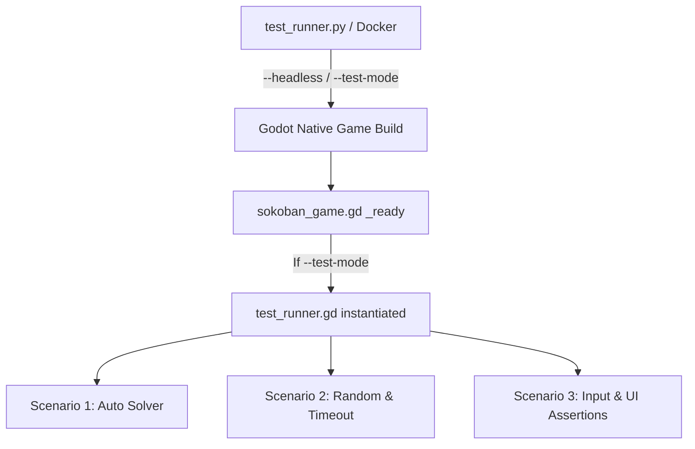

# Little Sokoban - Game Test Automation Feasibility & Specification

Sokoban 게임의 테스트 자동화를 위한 아키텍처 및 구현 설계 검토 결과입니다. Godot v4.7 엔진의 자체 기능 및 가상 입력 주입 메커니즘을 사용하면 외부 툴에 의존하지 않고도 높은 신뢰성을 가진 테스트 케이스를 구현할 수 있습니다.

---

## 1. 구현 가능성 검토 결과 (Feasibility Analysis)

**결론: 구현 가능성 매우 높음 (Highly Feasible)**

Godot Engine은 자동 테스트와 시뮬레이션에 필요한 강력한 CLI 인자 처리 및 입력 주입 API를 기본적으로 제공하므로, 요청하신 세 가지 시나리오를 완벽하게 자동화할 수 있습니다.

### 핵심 기술 요점
1. **모니터링 옵션 제어 (Headless vs Windows GUI)**
   - Godot 4.x는 `--headless` 플래그를 기본 제공합니다.
   - 화면으로 보면서 모니터링: `Godot.exe --path . -- --test-mode --scenario=1`
   - 화면 없이 백그라운드 테스트: `Godot.exe --path . --headless -- --test-mode --scenario=1`
2. **입력 시뮬레이션 (`Input.parse_input_event`)**
   - Godot의 `Input.parse_input_event()` API를 통해 키보드, 마우스, 게임패드 입력을 코드상에서 완벽히 주입할 수 있습니다.
   - UI 포커스 이동, 버튼 클릭, 드래그 제스처도 실제 입력과 완전히 동일하게 테스트할 수 있습니다.
3. **Docker 및 컨테이너 연동**
   - `--headless` 모드로 실행할 경우 OpenGL/Vulkan GUI 컨텍스트를 요구하지 않으므로, 복잡한 X11/VNC 설정 없이 **가벼운 Linux 컨테이너 환경(예: Debian/Alpine 기반 Docker)**에서도 네이티브 빌드가 완벽히 작동합니다.
   - 테스트 러너 파이썬 스크립트(`test_runner.py`)가 Godot 프로세스를 실행하고 로그나 종료 코드를 수집하여 성공 여부를 판단합니다.

---

## 2. 테스트 아키텍처 설계

테스트의 모듈화와 원본 코드 보존을 위해 **하이브리드 테스트 아키텍처**를 제안합니다.



### A. Godot 내부 진입점 설정 (`sokoban_game.gd`)
게임 실행 시 커맨드라인 사용자 인자(`--test-mode`)를 확인하여, 테스트 모드일 때만 테스트를 총괄하는 `test_runner.gd` 노드를 동적으로 생성하고 추가합니다.
```gdscript
# sokoban_game.gd의 _ready() 함수 시작 부분에 추가
var args = OS.get_cmdline_user_args()
var run_test = false
var scenario = 1
for arg in args:
    if arg == "--test-mode":
        run_test = true
    elif arg.begins_with("--scenario="):
        scenario = arg.split("=")[1].to_int()

if run_test:
    var tr = load("res://test_runner.gd").new()
    tr.scenario = scenario
    add_child(tr)
```

---

## 3. 시나리오별 세부 구현 전략

### 시나리오 1: 50스테이지 전체 자동 클리어 및 최고 점수 기록
- **작동 방식**:
  1. `levels_data_solution.json` 파일을 로드하고 파싱하여 메모리에 적재합니다.
  2. 현재 스테이지가 로드되면 해당 스테이지의 솔루션 문자열(예: `"LLLUUU..."`)을 0.1초 간격으로 한 문자씩 가상 입력으로 변환하여 주입합니다.
     - `L` -> `KEY_LEFT` (ui_left)
     - `R` -> `KEY_RIGHT` (ui_right)
     - `U` -> `KEY_UP` (ui_up)
     - `D` -> `KEY_DOWN` (ui_down)
  3. 모든 박스가 골에 도착하면 `VictoryOverlay`가 활성화됩니다. 이때 다음 스테이지 버튼 누르기 입력을 시뮬레이션하거나 직접 `load_next_level()`을 호출합니다.
  4. 50스테이지를 모두 클리어한 후 `HighscoreEntryPopup`이 나타나면 이름(`"BOT_SOLVER"`)을 입력 필드에 입력하고 OK 버튼 클릭을 시뮬레이션합니다.
  5. 리더보드 API 통신 완료 이벤트(또는 타임아웃)가 확인되면 `get_tree().quit(0)`으로 성공 종료합니다.

### 시나리오 2: 랜덤 키 플레이 후 1분 초과 시 게임오버 및 점수 기록
- **작동 방식**:
  1. 스테이지 1에서 0.1초마다 랜덤한 방향키(Up, Down, Left, Right)를 무작위로 선택하여 주입합니다.
  2. 스테이지 플레이 시작 후 1분(60초) 동안 대기하며, 클리어가 일어나지 않음을 모니터링합니다.
  3. 1분이 경과하는 순간 강제로 타임아웃/게임오버 상태를 트리거합니다.
     - 게임의 남은 시간(`time_remaining = 0`)으로 만들어 생명을 차감하거나, `lives = 0`으로 수정한 후 `lose_life()`를 강제 호출하여 즉시 `GameOverOverlay`가 뜨게 만듭니다.
  4. `GameOverOverlay`에서 'TRY AGAIN' 버튼 누르기를 주입하여 `HighscoreEntryPopup`을 활성화합니다.
  5. 시나리오 1과 마찬가지로 이름 입력 및 점수 등록을 마친 후 `get_tree().quit(0)`으로 종료합니다.

### 시나리오 3: 입력 장치 다양성 & 메뉴 UI 상태 변경 검증
- **작동 방식**:
  1. **다양한 입력 시뮬레이션**:
     - **키보드**: `KEY_ESCAPE`를 주입하여 메뉴를 엽니다.
     - **게임패드**: `JOY_BUTTON_START` 입력을 주입해 메뉴를 다시 여닫거나, `JOY_BUTTON_A`로 포커스된 버튼을 클릭합니다.
     - **마우스**: 특정 좌표 클릭(`InputEventMouseButton`) 및 드래그 제스처(`InputEventScreenTouch`)를 시뮬레이션하여 화면이 밀리거나 캐릭터의 pathfinding이 작동하는지 검증합니다.
  2. **UI 상태 변경 및 Assertion**:
     - 메뉴가 열리면 `SokobanMenu` 노드가 씬 트리에 실제로 존재하는지(`has_node("SokobanMenu")`) 검증합니다.
     - 'Theme' 버튼 클릭 -> 'Kenney' 테마 선택 -> 테마가 `kenney`로 변경되었는지, 보드가 새로 그려졌는지 확인합니다.
     - 'Leaderboard' 버튼 클릭 -> 'Loading...' 라벨 노출 확인 -> 서버 통신 성공 후 `ScoreList`에 데이터 행들이 생성되었는지 검증합니다.
     - 'License' 버튼 클릭 -> 라이선스 정보 라벨에 MIT 및 CC0 라이선스 텍스트가 올바르게 들어있는지 검증합니다.
     - 모든 UI 검증(Assertion)이 통과하면 `get_tree().quit(0)`을 호출하고, 실패 시 `get_tree().quit(1)`로 에러 코드를 반환합니다.

---

## 4. 테스트 자동화 실행 예시

파이썬 스크립트(`test_runner.py`)를 통해 모니터링 모드 및 시나리오를 손쉽게 실행할 수 있도록 지원합니다.

```python
# test_runner.py 실행 예시

# 1. 화면을 보면서 50스테이지를 모두 클리어 테스트 (시나리오 1)
python test_runner.py --scenario 1 --monitor

# 2. 헤드리스 모드로 랜덤 플레이 후 1분 뒤 게임오버 테스트 (시나리오 2)
python test_runner.py --scenario 2

# 3. 화면을 보면서 모든 입력 방식 및 UI 기능 테스트 (시나리오 3)
python test_runner.py --scenario 3 --monitor
```

### Docker 환경 구축 (선택 사항)
CI/CD 파이프라인이나 독립된 컨테이너 환경에서 테스트를 구동하고 싶다면 다음과 같이 Dockerfile을 작성하여 실행할 수 있습니다. Godot의 `--headless` 모드 덕분에 별도의 가상 디스플레이(Xvfb 등) 설정 없이도 아주 가볍게 동작합니다.

```dockerfile
FROM debian:bookworm-slim

# 필요한 패키지 설치
RUN apt-get update && apt-get install -y \
    ca-certificates \
    python3 \
    python3-pip \
    && rm -rf /var/lib/apt/lists/*

WORKDIR /app
COPY . .

# 테스트 러너 실행 (기본적으로 headless로 구동)
CMD ["python3", "test_runner.py", "--scenario", "1"]
```
