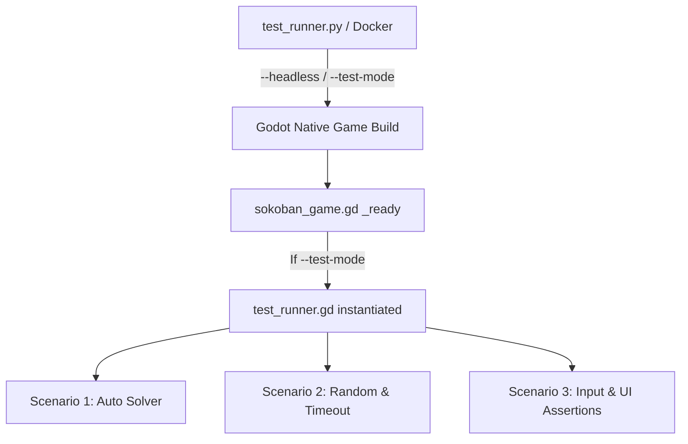

# Little Sokoban - Game Test Automation Feasibility & Specification

This document outlines the architecture and implementation design for the test automation of the Sokoban game. By utilizing Godot v4.7's built-in engine capabilities and virtual input injection mechanisms, high-reliability test cases can be implemented without relying on external automation tools.

---

## 1. Feasibility Analysis

**Conclusion: Highly Feasible**

Since the Godot Engine natively provides a robust CLI argument parsing capability and input injection APIs required for automated testing and simulation, the three requested scenarios can be fully automated.

### Key Technical Points
1. **Monitoring Option Control (Headless vs Windows GUI)**
   - Godot 4.x natively supports the `--headless` flag.
   - Run with visual GUI window: `Godot.exe --path . -- --test-mode --scenario=1`
   - Run in the background without a window: `Godot.exe --path . --headless -- --test-mode --scenario=1`
2. **Input Simulation (`Input.parse_input_event`)**
   - Godot's `Input.parse_input_event()` API allows keyboard, mouse, and gamepad inputs to be completely injected via code.
   - UI focus changes, button clicks, and drag gestures can be verified exactly like actual user input.
3. **Docker and Container Integration**
   - Running in `--headless` mode does not require an OpenGL/Vulkan GUI context.
   - It runs out-of-the-box in lightweight Linux container environments (e.g., Debian/Alpine-based Docker) without needing virtual display servers (like X11 or VNC).
   - The python wrapper script (`test_runner.py`) handles Godot process spawn, logs aggregation, and exit code assertions.

---

## 2. Test Architecture Design

For modular testing and codebase preservation, a **Hybrid Test Architecture** is adopted.



### A. Godot Internal Entry Point (`sokoban_game.gd`)
Upon game launch, the command-line user arguments are inspected for the `--test-mode` flag. If present, the `test_runner.gd` node is instantiated dynamically to manage the test flows.
```gdscript
# Inside sokoban_game.gd _ready()
var args = OS.get_cmdline_user_args()
var test_mode = false
var scenario = 1
var start_level = 1
for arg in args:
	if arg == "--test-mode":
		test_mode = true
	elif arg.begins_with("--scenario="):
		scenario = arg.split("=")[1].to_int()
	elif arg.begins_with("--level="):
		start_level = arg.split("=")[1].to_int()

if test_mode:
	var test_runner = load("res://test_runner.gd").new()
	test_runner.scenario = scenario
	test_runner.start_level = start_level
	add_child(test_runner)
```

---

## 3. Detailed Scenario Implementation Strategies

### Scenario 1: 50-Stage Auto-Solver and Highscore Submission
- **Mechanics**:
  1. Loads and parses the `levels_data_solution.json` dataset.
  2. For the active stage, maps each character of the solution path string (e.g. `"LLLUUU..."`) to virtual key actions injected sequentially at short intervals (0.12s per step):
     - `L`, `l` -> `KEY_LEFT` (ui_left)
     - `R`, `r` -> `KEY_RIGHT` (ui_right)
     - `U`, `u` -> `KEY_UP` (ui_up)
     - `D`, `d` -> `KEY_DOWN` (ui_down)
  3. Once all boxes reach goals and the `VictoryOverlay` is activated, simulates the next stage transition (triggering `load_next_level()`).
  4. After solving all 50 stages and the `HighscoreEntryPopup` appears, injects username `"BOT_SOLVER"` into the input field and simulates clicking OK.
  5. Upon confirmation of the leaderboard API server callback (or a timeout), terminates gracefully with `get_tree().quit(0)`.

### Scenario 2: Random Input Play and Timeout Game Over Assertions
- **Mechanics**:
  1. Sequentially injects random directional inputs (Up, Down, Left, Right) at 0.1s intervals starting at Level 1.
  2. Waits for 1 minute (60 seconds) to monitor that no unintentional stage clears occur.
  3. Triggers a forced Game Over after the 60-second limit:
     - Reduces game time (`time_remaining = 0`) or remaining lives (`lives = 0`) to trigger `GameOverOverlay` immediately.
  4. Simulates pressing the 'TRY AGAIN' button inside `GameOverOverlay` to trigger the `HighscoreEntryPopup`.
  5. Submits scores and username, then terminates gracefully with `get_tree().quit(0)`.

### Scenario 3: Input Device Diversity & UI Menu Interactions
- **Mechanics**:
  1. **Multi-Input Simulations**:
     - **Keyboard**: Injects `KEY_ESCAPE` to open the overlay menu.
     - **Gamepad**: Injects `JOY_BUTTON_START` to toggle the menu, and `JOY_BUTTON_A` to press buttons.
     - **Mouse**: Injects mouse clicks (`InputEventMouseButton`) and drag gestures (`InputEventScreenTouch`) to assert that screen swipe gestures or player pathfinding walks trigger correctly.
  2. **UI State Verifications**:
     - Asserts that the menu node is present in the scene tree (`has_node("SokobanMenu")`).
     - Simulates clicking the 'Theme' button, choosing 'Kenney', and asserts that the theme changes to `kenney` and the board redraws correctly.
     - Simulates clicking the 'Leaderboard' button, checks for the 'Loading...' label state, and asserts that leaderboard list rows populate successfully after API responses.
     - Simulates clicking the 'License' button, and asserts that the license content contains correct MIT and CC0 license strings.
  3. Gracefully quits with code `0` on success and code `1` on any assertion failure.

---

## 4. Test Execution Examples

The python script wrapper (`test_runner.py`) provides arguments to easily run the scenarios:

```bash
# 1. Solve and verify all 50 stages visually in headful mode (Scenario 1)
python test_runner.py --scenario 1 --monitor

# 2. Run Scenario 2 headlessly in the background (Scenario 2)
python test_runner.py --scenario 2

# 3. Verify input mappings and UI actions visually (Scenario 3)
python test_runner.py --scenario 3 --monitor
```

### Docker Setup (Optional)
To run tests in a CI/CD pipeline or isolated environments, you can use the following Dockerfile. Since Godot's `--headless` mode does not require X11 or virtual framebuffer configurations (like Xvfb), the container runs extremely light.

```dockerfile
FROM debian:bookworm-slim

# Install dependencies
RUN apt-get update && apt-get install -y \
    ca-certificates \
    python3 \
    python3-pip \
    && rm -rf /var/lib/apt/lists/*

WORKDIR /app
COPY . .

# Run the test runner (defaults to headless execution)
CMD ["python3", "test_runner.py", "--scenario", "1"]
```
